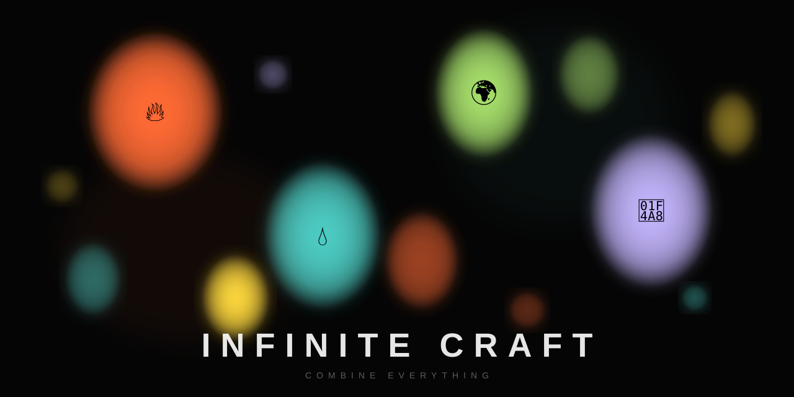

# Infinite Craft Explorer

  

  <a href="https://infinite-craft.phenomsec.com"><strong>Live Dashboard</strong></a> · <a href="HOWTO.md">Deploy Your Own</a> · <a href="DEPLOY.md">Full Deployment Guide</a>

---

Start with four elements. Combine everything. See how far the rabbit hole goes.

[Infinite Craft](https://neal.fun/infinite-craft/) by Neal Agarwal gives you **Water**, **Fire**, **Wind**, and **Earth**. Combine any two and something new appears. Water + Fire = Steam. Earth + Wind = Dust. Steam + Earth = Mud. Mud + Fire = Brick. Brick + Brick = Wall...

**But what happens if you just... keep going?**

This project answers that question with an army of autonomous serverless workers that explore the combinatorial space 24/7, running on AWS Free Tier for $0/month.

## The Numbers (So Far)

| | |
|---|---|
| **8,579** | elements discovered |
| **48,847** | recipes cataloged |
| **506** | first-ever global discoveries |
| **63** | deepest generation reached |
| **$0.00** | monthly AWS cost |

The workers pulse every 4 hours, trying new combinations and logging everything. The element space appears to be effectively infinite — every session finds new things.

## Down the Rabbit Hole

It starts normal enough. Water + Fire = Steam. Sure. Earth + Fire = Lava. Fine.

Then things get... creative.

| Recipe | Result | Gen |
|--------|--------|:---:|
| Dusty Wind + Swamp Thing | Dusty Swamp Thing | 8 |
| Hawaiian Cider + Apple Oedipus | Apple Oedipus Rex | 7 |
| Soup-er Nova + Luke Skywalker | Luke Soup-er Nova | 9 |
| Iphone 15 Pro Max + Apollo 13 | Apollo 15 Pro Max | 12 |
| Landscape + Self-Portrait | Landscape with a Corpse | 12 |
| Steampunk Optimus Prime + Motown | Steamotown Prime | 15 |
| Anubis + Brexit | Anubexit | 33 |
| Chocolate Gandalf + Liberia | Chocolate Jesus | 43 |
| Pink Crunk + Bumblebee Conch | Pink Bumblebee Conch | 60 |

Generation 60. That means it took 60 layers of combination, building on building on building, to reach "Pink Bumblebee Conch." Starting from water.

## First Discoveries

When you find an element that no one in the world has ever created before, Infinite Craft marks it with a special badge. Our explorers have found **506** of these.

Some highlights we discovered first:

| Discovery | Recipe | Gen |
|-----------|--------|:---:|
| Darth Icewind | iWind + Darth Iceberg | 5 |
| Steamotown Prime | Steampunk Optimus Prime + Motown | 15 |
| Shadow Celtics | Boston Celtics + Shadow Mario | 26 |
| Bumblebee Conch | Conch + Bumblebee Shark | 39 |
| Gandalf the Spartacus | Gandalf Best + Spartacus | 41 |
| Pink Bumblebee Conch | Pink Crunk + Bumblebee Conch | 60 |

Nobody had ever combined "Gandalf Best" with "Spartacus" before us. We live in the best timeline.

## The Most Prolific Ingredients

Some elements are the glue that holds the craft universe together:

| Element | Recipes | Gen |
|---------|:-------:|:---:|
| Fire | 785 | 0 |
| Water | 533 | 0 |
| Earth | 516 | 0 |
| Wind | 383 | 0 |
| Dusty Wind | 145 | 1 |
| Painter | 135 | 1 |
| Drumstick | 121 | 2 |
| Malaria | 107 | 4 |
| Crocodile | 105 | 4 |
| Aphrodite | 78 | 4 |

"Malaria" is in the top 10 most useful ingredients. Somehow it combines with 107 other things to make new elements. Don't ask.

## How Deep Does It Go?

Elements have **generations** — how many combination steps it took to create them from the four base elements. Generation 0 is Water/Fire/Wind/Earth. Generation 1 is everything you can make directly from those.

Our deepest discovery so far: **Generation 63**.

The generation distribution has a fascinating double-peak pattern — a spike at generation 1 (simple combinations), a valley around generation 15-20, and then a second wave of complex elements stretching out to generation 63. The element space doesn't peter out — it opens back up.

## The Dashboard

The [live dashboard](https://infinite-craft.phenomsec.com) shows everything in real time:

- **Force-directed graph** — see how elements connect, colored by generation
- **Dependency chains** — trace any element back to its Water/Fire/Wind/Earth origins
- **Analytics** — generation distribution, name lengths, most-used ingredients
- **Worker activity** — watch the explorers work in near real-time
- **Search** — look up any element across the full database

## Under the Hood

Fully serverless on AWS. No servers to manage, no bills to pay.

Self-coordinating Lambda workers fire every 4 hours, pick a strategy (breadth-first, random, or anchor sweep), try new element combinations against the neal.fun API, and save everything to DynamoDB. A read-only API serves the dashboard through CloudFront.

The whole thing runs on AWS Free Tier. Zero dollars. Forever.

Want to run your own? See [HOWTO.md](HOWTO.md) for setup instructions.

## License

MIT
